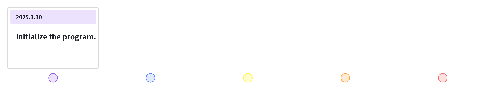
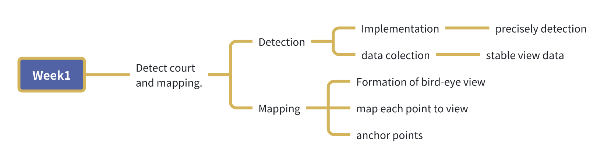

# Frisbee_Detection

# Intro
Let's go Magnus!  
I am a frisbee player, and I am really keen on that. I feel that frisbee is part of my life, and I can live no more without it. It has been a long-embedded idea for me to combine my major with my interest. In this project, I am going to implement a frisbee analysis model. Let's see how far I can go.  

# Ultimate Goal
This is currently divided into two stages.  

The first stage is pure CV. The goal is to use YOLO and OpenCV to facilitate a machine that can detect players, frisbee, and the court, track everything, and produce possible data and analyses.  

The second stage involves using AI methods such as Machine Learning, Deep Learning, and model training to create a custom model that can detect, analyze, and even predict events happening on the court.  

## Goal 1: Detection Model
1. Detect the court and map it to a bird's-eye view graph.  
2. Detect players and map them to the bird's-eye view graph.  
3. Detect the frisbee and map it to the bird's-eye view graph.  
4. Detect players from different teams and map them to different colors.  
5. Detect the number of players.  
6. Determine the velocity of players and the frisbee.  
7. Track the movement of players and the frisbee.  
8. Manage data.  
9. Visualization.  

## Goal 2: Prediction Model
1. Collect enough data.  
2. Normalize data.  
3. Design the model.  
4. Train the model.  
5. Make predictions.  

# Important Diary
A weekly diary is used to track progress made each week.  

# Weekly Schedule
Breaking down big tasks into smaller ones that can be completed within a week.  

## Week 1  

# References
- Blog from Krish  
- Code Space  

